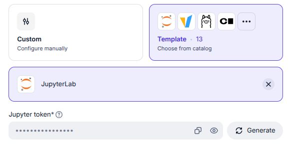
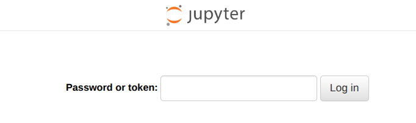

# Give your LLM a character

Modern language models are rather good at making words follow other words.
They are also rather large.

Getting one onto a GPU, let alone teaching it something new, can turn into a memory puzzle.
Every gigabyte we avoid using is also a small favour to the budget.

In this practical, you will try **Nebius Serverless AI** with a model from the [Qwen2.5 family](https://huggingface.co/collections/Qwen/qwen25).
The dialogue comes from Shakespeare plays or public-domain character roleplay: Dracula, Sherlock Holmes, Odysseus, Dorian Gray, and the Cheshire Cat.
This is an excuse to give a model a voice and a soul, and to discover what the GPU actually has to hold while you do it.

## What you'll do

1. **Estimate** how much GPU memory a model needs.
2. **Deploy** a model behind an API (an **Endpoint**) and ask it a few questions from your DevLab.
3. **Fine-tune** it on a character's dialogue with a GPU **Job**.
4. **Serve** the fine-tuned character through another Endpoint.
5. **Compare** it with prompting a larger hosted model through Nebius Token Factory.

A **Job** finishes after running its task, so we use it for training.
An **Endpoint** stays available for requests, so we use it for inference.

The DevLab is where you edit the training configuration and run the small [notebook](lab.ipynb).
The containers already have the serving or training software installed. You do not have to build them.

Questions you need to answer are marked **❓ Q1–Q15**.
Answers to the calculation in Q8 are in [Solutions](#solutions) at the end.

## Before you start

### Choose your workshop name

Before you start, choose a **group name** for your team, or a username if you are working alone.
Everyone shares the same project, so make it specific enough that another participant is unlikely to choose it.
Use lowercase letters, numbers and hyphens, with no spaces.

Keep this name throughout the practical. Include it in your Job and Endpoint names so you can find them in the console. Training results will be saved under `uu-workshop-output/<group-name>/runs/<run-id>/`; give each training attempt a different run ID. Write down your group name and run IDs so you can find your results later.

### Set up your DevLab

Do the practical in a Nebius DevLab, so you do not need to install anything on your own computer.

1. Open the [workshop project in the Nebius console](https://console.nebius.com/project-e00kjyj0pr00mf5kcczh6n).
2. Go to **Serverless AI → DevLab → JupyterLab → Create DevLab**. Select the **JupyterLab** template, give the DevLab a name that includes your group name so you can find it among your classmates' DevLabs, and choose **Without GPUs**. Keep the other defaults; you do not need to mount volumes or upload files.
3. **Save the Jupyter token** shown on the Create DevLab page. You will need it to open JupyterLab. Keep it private.

   

4. Create the DevLab. It may take a few minutes to become available. Continue with [Every token counts](#every-token-counts) while it starts; return to step 5 when it is ready. You can also start creating the first Endpoint before the DevLab is ready.
5. When the DevLab shows **RUNNING**, click its name in the DevLab list. Under **Endpoint URL**, copy the **Public endpoint** URL and open it in a new browser tab.
6. On the Jupyter login page, paste the token you saved in step 3 into **Password or token** and click **Log in**. You can ignore the other options on that page.

   

7. In JupyterLab, open a **Terminal** and run:

   ```bash
   git clone https://github.com/nicogreeco/shakespeare-axolotl-workshop.git
   cd shakespeare-axolotl-workshop
   python -m pip install -r requirements.txt
   ```

The terminal already has its Python environment active, so you do not need to create a virtual environment. The requirements install only the OpenAI Python SDK used by the notebook; training runs later in a separate Axolotl Job. In JupyterLab, edit `training.yaml`, and run `lab.ipynb` when prompted. If you installed the requirements in the terminal, you can skip the notebook's first `%pip install` cell.

## Every token counts

### Tokens and parameters

A language model takes the tokens it has seen so far and predicts the next one.
A token can be a word, part of a word, or punctuation.

Transformer-based models such as Qwen2.5 generate one token after another.
Their learned weights encode patterns that let them produce useful answers.

The **B** in 7B means *billion* parameters.
You can now guess why they are called *large* language models.
The family includes instruction-tuned variants at [7B](https://huggingface.co/Qwen/Qwen2.5-7B-Instruct), [14B](https://huggingface.co/Qwen/Qwen2.5-14B-Instruct), [32B](https://huggingface.co/Qwen/Qwen2.5-32B-Instruct), [72B](https://huggingface.co/Qwen/Qwen2.5-72B-Instruct), and other sizes.
We use the **Instruct** variants because they are trained to follow chat messages.

### How much memory do the weights need?

A weight is a number stored as bits, the 0s and 1s in computer memory. Eight bits make one byte.
There are different ways to represent numbers with those bits:

- **FP32** is a 32-bit floating-point format: 4 bytes per weight.
- **BF16** uses 16 bits: 2 bytes per weight. It uses less memory at the cost of numerical precision.

We do not need the details of the encoding here.
For a first estimate of the memory required by a model, use:

```text
weight memory (bytes) ≈ number of parameters × bytes per parameter
weight memory (GB)    ≈ weight memory (bytes) / 1,000,000,000
```

> **📘 Example**
>
> Ignoring everything else, a 7B model needs roughly **28 GB in FP32** or **14 GB in BF16**.

BF16 is widely used for LLM workloads.
It halves weight storage compared with FP32, while usually retaining enough precision for training and inference.

> [!NOTE]
> BF16 keeps FP32's wide range of representable values (roughly 10⁻³⁸ to 10³⁸), but with less precision.
> In practice, this wide range is often more valuable than extremely fine precision.

### Where do the weights live?

The NVIDIA H100 in this exercise has [80 GB of GPU memory](https://www.nvidia.com/en-us/data-center/h100/).
The preset also lists 200 GiB of system RAM, which is a different pool.

The GPU does the calculations and reads the model's weights again and again as it generates tokens.
Its own high-bandwidth memory supplies those weights much faster than system RAM could.
So in this setup, the weights need to fit on the GPU.

> **❓ Q1 — Which model fits for inference?**
>
> Before creating an endpoint, estimate the BF16 weight memory for **32B** and **72B**.
> Which one looks plausible on one H100? Leave room beyond the weights.

### Why leave extra room? The KV cache

At each Transformer layer, a token produces attention **keys** and **values**.
When the model generates the next token, it can reuse the earlier ones instead of recalculating the whole conversation.
The stored keys and values are the **KV cache**.

- Longer conversations and more simultaneous requests need more cache.
- For a fixed model, the cache size grows roughly with the number of cached tokens.
- Our prompts are short, but the cache and other serving buffers still need GPU memory.

### Training needs more

Besides the weights, training keeps:

1. **Activations**: intermediate results produced as examples pass through the layers.
   Some are needed again when the model calculates how to update its weights.
2. **Gradients**: one for each trainable weight.
3. **Optimizer state**: the Adam optimizer, for example, tracks two running values per trainable weight.

If we *pretend* all these values use BF16, full fine-tuning needs, before activations:

```text
2 bytes (weight) + 2 bytes (gradient) + 2 + 2 bytes (Adam) = 8 bytes per parameter
```

> **❓ Q2 — Can we fully fine-tune 14B?**
>
> Try this calculation for 14B. Does it fit in 80 GB?

Real optimizer states may use FP32, so this estimate can be optimistic.

A **microbatch** is the number of examples processed together in one pass.
A larger microbatch usually needs more activation memory.
In exchange, averaging over more examples can make the gradient less noisy.
[PyTorch's activation-memory guide](https://docs.pytorch.org/tutorials/beginner/mosaic_memory_profiling_tutorial.html) shows why keeping intermediate results matters.

[](https://pytorch.org/blog/understanding-gpu-memory-1/)

*GPU memory profile over several training steps.
This example uses vanilla SGD with momentum, which stores one optimizer value per weight; as a result, optimizer memory is the same as parameter memory.
Source: [PyTorch Blog](https://pytorch.org/blog/understanding-gpu-memory-1/).*

### LoRA: train a small adapter instead

**LoRA** leaves the model's original weights frozen and learns only a small update for each selected weight matrix.

- Instead of a full-sized update, it stores the update as the product of two smaller matrices (A and B in the image below).
- Their inner dimension is the **rank** (`lora_r` in our YAML).
  A lower rank uses less memory but limits how much the model can change.
- These learned matrices form the **adapter**. Gradients and optimizer states are needed only for them.

Two things do not change:

- The full base model must still fit in memory.
- The saved adapter must be loaded with the same base model to produce the fine-tuned behaviour.

[This LoRA explanation](https://huggingface.co/docs/peft/main/task_guides/lora_based_methods) goes further if you are curious.

[](https://www.geeksforgeeks.org/deep-learning/low-rank-adaptation-lora/)

*Full parameter fine-tuning updates all weights, while LoRA trains only small adapter matrices.
Source: [GeeksforGeeks](https://www.geeksforgeeks.org/deep-learning/low-rank-adaptation-lora/).*

## Put a model behind an API

An endpoint starts a container, runs a command in it, and exposes a port as an HTTPS API.

Inside our container, [vLLM](https://docs.vllm.ai/en/latest/serving/openai_compatible_server/):

- loads the model onto the GPU,
- manages requests and its KV cache,
- returns generated text through an API compatible with the OpenAI Python SDK.

Later, it will also let us select the base model or its LoRA adapter by model name.

Your DevLab may be ready by now. If it is, finish its terminal setup. If not, go ahead and create this Endpoint while the DevLab starts; you will need the DevLab when you reach the notebook.

### Create an endpoint

1. Open the [Nebius console](https://console.nebius.com/project-e00kjyj0pr00mf5kcczh6n).
2. Go to **Serverless AI → Endpoints → Create endpoint** and choose **Custom**.
3. Fill in the fields:

| Console field | Value |
|---|---|
| Name | Include your group name, for example `utrecht-holmes-3-base` |
| Image path | `docker.io/vllm/vllm-openai:latest` |
| Port | `8000` (HTTP) |
| Entrypoint command | Leave it empty for now: we'll fill it in at the end |
| Bearer-token authentication | Off for this classroom endpoint |
| Platform | With GPU, NVIDIA H100 NVLink; 1 GPU - 16 vCPUs - 200 GiB RAM |
| Container disk | 200 GiB |
| Network / subnet | The available default for your project |
| Mounted volumes | None |

### Choose a model

The image contains vLLM and its dependencies.
Its **entrypoint command** tells it which model to download and how to run the API.

> **❓ Q3 — Choose your model size**
>
> Use your weight-memory estimate to choose a model: **7B, 14B, 32B or 72B**.
> Could it fit with room for the KV cache and serving overhead? Assume at least 5 GB extra.
> Which is the largest size you would try on this GPU?

The largest model that fits is not necessarily the best choice for a 45-minute workshop. Use **Qwen2.5-14B-Instruct** (or 7B for a faster run) rather than 32B: downloading the larger weights and training the larger model take more time. Keep the same model ID for this Endpoint, the training Job, and the final Endpoint. Put it after `--model` in the command below.

> **📘 Example** — the command for the 14B model:
>
> ```bash
> python3 -m vllm.entrypoints.openai.api_server \
>   --model Qwen/Qwen2.5-14B-Instruct \
>   --dtype bfloat16 \
>   --max-model-len 2048 \
>   --gpu-memory-utilization 0.85 \
>   --host 0.0.0.0 \
>   --port 8000
> ```

Where:

- `--dtype` selects BF16,
- `--max-model-len` limits the total input and output context,
- `--gpu-memory-utilization` sets vLLM's GPU-memory budget.

4. Paste the command into **Entrypoint command**.
5. Create the Endpoint. While it starts, finish setting up your DevLab if needed. Continue once both are ready.

### Get the endpoint URL

Copy the endpoint's HTTPS URL from **Copy endpoint URL → Public endpoint**.
The [Nebius endpoint guide](https://docs.nebius.com/serverless/tutorials/deploy-model) shows this console flow.

## Play with the model

Open [the notebook](lab.ipynb) in your DevLab's JupyterLab, paste the Endpoint URL, and play with its ready-made questions (Sections 1 and 2).

### Look at memory usage in the logs

Open the endpoint's **Logs** tab in the Nebius Console.
During startup, look for:

- the model name,
- the dtype,
- the maximum sequence length,
- the line that reports GPU memory use.

> **❓ Q4 — Logs vs. your estimate**
>
> How does the reported memory compare with your weight-only estimate?
> Can you spot the memory set aside for the KV cache?

> **📘 Example** — one Qwen2.5-32B test with the command above:
>
> - 61.97 GiB for weights and other non-PyTorch memory
> - 3.18 GiB for peak activations
> - 0.62 GiB for CUDA graphs
> - 2.15 GiB for the KV cache
>
> That cache held 8,800 tokens, or about four concurrent requests at the 2,048-token limit.
> Your values will depend on the image and settings.

The logs make the memory budget more concrete than a single dashboard number.
vLLM's logs also estimate how many tokens and simultaneous requests fit in the KV cache.

### Watch a request

After sending a notebook request, look in the logs for:

- `POST /v1/chat/completions` with `200 OK`,
- an engine log showing prompt or generation throughput.

The **Metrics** tab shows the state of the virtual machine running the endpoint.
Click **GPU metrics** and send a request from the notebook.

> **❓ Q5 — Metrics**
>
> What changes while a request is running?

> [!NOTE]
> The Metrics tab can sometimes be buggy.
> If nothing happens, do not worry too much and continue with the practical.

## Training: Give it a voice

> [!WARNING]
> Stop this first endpoint before continuing, so it no longer reserves a GPU.

### Look at the data

We prepared chat-format JSONL datasets from [Shakespeare dialogue](https://huggingface.co/datasets/chaseharmon/6.7960_Shakespeare) and [public-domain character roleplay](https://huggingface.co/datasets/agentlans/practical-dreamer-RPGPT_PublicDomain).
Each line is one conversation.

> **📘 Example** — an illustrative line (not from the actual data):
>
> ```json
> {"messages": [{"role": "user", "content": "I seem to have lost my way."}, {"role": "assistant", "content": "Perhaps the way has lost you."}]}
> ```

- The character material is roleplay *inspired by* the characters, not quotations from the original books.
- Shakespeare consists of adjacent lines from plays, in Early Modern English.

The user message supplies the context, and we train the model to predict the assistant response.
In the YAML, this is expressed by `roles_to_train: [assistant]` and `train_on_inputs: false`.

For this 45-minute workshop, choose one of the character datasets, such as the Cheshire Cat or Dorian Gray.
Shakespeare takes significantly longer to train, so it is not recommended for the hands-on session.

| Voice | Directory inside the Job |
|---|---|
| Cheshire Cat | `/inputs/datasets/public-domain/the-cheshire-cat/` |
| Dracula | `/inputs/datasets/public-domain/count-dracula/` |
| Sherlock Holmes | `/inputs/datasets/public-domain/sherlock-holmes/` |
| Odysseus | `/inputs/datasets/public-domain/odysseus/` |
| Dorian Gray | `/inputs/datasets/public-domain/dorian-gray/` |
| Shakespeare dialogue | `/inputs/datasets/shakespeare/` |

> **❓ Q6 — Inspect the data**
>
> If the datasets are visible in your DevLab, open a `train.jsonl` file and look at a couple of lines.
> What is the input, and what is the answer?

### Make your training configuration

Open [training.yaml](training.yaml). This one YAML file is the starting point for every voice.
[Axolotl](https://docs.axolotl.ai/) reads it to load the model and data, train LoRA, and choose checkpoints.

Find `base_model`, `datasets`, `test_datasets`, `sequence_len`, `bf16`, and `lora_r`.

> **❓ Q7 — Read the configuration**
>
> - What is the longest training sequence this configuration allows?
> - What precision will the job use?
> - What LoRA parameters are used?

Now edit the YAML:

1. **Dataset paths.** Set *both* paths to your chosen directory.
   Keep `train.jsonl` for training and `validation.jsonl` for validation.
2. **Base model.** The default `Qwen/Qwen2.5-14B-Instruct` is the balanced choice for this workshop.
   - `Qwen/Qwen2.5-7B-Instruct` gives a faster run.
   - `Qwen/Qwen2.5-32B-Instruct` is the ambitious option that exploits most of the H100's memory.
3. **Batch.** Use `micro_batch_size: 8` and `gradient_accumulation_steps: 2`, for an effective batch of 16.
   Axolotl accumulates gradients across two microbatches before updating the adapter.
4. **Rank.** Keep `lora_r: 16`.
5. **Schedule.** Use the values for the dataset you chose:

| Dataset | Learning rate | Max steps | Eval/save every | Patience |
|---|---:|---:|---:|---:|
| Character roleplay | `0.00005` | 90 | 15 | 1 |
| Shakespeare (optional) | `0.0002` | 250 | 125 | 1 |

> [!IMPORTANT]
> A LoRA adapter can only be loaded with the base checkpoint on which it was trained.
> Note the exact model ID you train with: the final endpoint must use the same one.

With `load_best_model_at_end: true`, Axolotl saves the checkpoint with the best validation loss.
Gradient checkpointing, also enabled in the YAML, saves memory by recomputing some intermediate values.

### Estimate the training memory

Build the estimate yourself rather than starting from a formula.
For rank 16, assume the adapter contains roughly **0.5% of the base parameters**, so `A ≈ 0.005 × P`.

> **❓ Q8 — LoRA training memory**
>
> Think about what must be stored for each type of parameter:
>
> 1. The `P` base parameters are frozen. They need one BF16 value each, but no gradients or optimizer states.
>    How many bytes is that per parameter?
> 2. Each of the `A` trainable adapter parameters needs its BF16 weight, its gradient, and Adam's two running values.
>    If we pretend they are all BF16, how many bytes is that per parameter?
>
> Complete the estimate:
>
> ```text
> LoRA training state (bytes) ≈ ___P + ___A
> ```
>
> Then estimate it for **14B** and **32B**, and leave at least another 10 GB for activations, temporary buffers and the runtime.
> **Which would you try on 80 GB?**
>
> Write down your reasoning before checking [Solutions](#solutions).

This is a rough budget: optimizer states can use a higher precision, and activations depend on sequence length and microbatch.

On one H100, **14B is the recommended choice** for this 45-minute workshop.
32B can train on a short character dataset, but takes longer and leaves less room for long examples.

> [!TIP]
> If a job runs out of memory, lower `micro_batch_size` and raise `gradient_accumulation_steps`.
> This keeps the effective batch near 16.

You can also try `lora_r: 8` and `lora_alpha: 16` as a separate experiment.

> **❓ Q9 — Halving the rank**
>
> Roughly how would halving the rank affect `A` and the *total* memory estimate?

### Start a GPU Job

1. In the console, open **Serverless AI → Jobs → Create job**.
2. Choose the **Axolotl template** (the **Custom** route works too).
3. Replace its defaults with these settings:

| Console field | Value |
|---|---|
| Name | Include your group name and run ID, for example `utrecht-holmes-3-run-1` |
| Image path | `docker.io/axolotlai/axolotl:main-20260309-py3.11-cu128-2.9.1` |
| Compute, disk, network | H100, 1 GPU / 16 vCPUs / 200 GiB RAM, 200 GiB disk, your project's default subnet |
| Timeout | 2 hours |
| First mounted volume | `uu-workshop-input` at `/inputs`, read-only |
| Second mounted volume | `uu-workshop-output` at `/outputs`, read-write |
| Files | Paste or upload your entire edited YAML at `/config/axolotl.yaml` |

The [Nebius fine-tuning tutorial](https://docs.nebius.com/serverless/tutorials/fine-tuning) has screenshots of the console.
See [Nebius's Job guide](https://docs.nebius.com/serverless/jobs/manage) for the **Files** controls.
You can paste the YAML from your editor, or download it from JupyterLab and upload it from your computer.

**About the mounts.** A mounted Object Storage bucket appears as files in the container.

> **📘 Example**
>
> `s3://uu-workshop-input/datasets/shakespeare/train.jsonl` becomes `/inputs/datasets/shakespeare/train.jsonl`.

- The input mount supplies datasets and the runner script (the same files you find here in `data/` and `src/`).
- The output mount receives the adapter and run artifacts.

**About the disk.** The 200 GiB container disk is separate from GPU memory.
It holds the container image, the downloaded model shards, and the Hugging Face cache.
100 GiB is not enough for the 32B option in this setup.

4. Use the group name you chose at the start and choose a new **run ID** for this attempt.
   Include both in the Job name so you can recognize the run in the shared project.
5. Give the entrypoint this command, replacing `my-group` and `run-1` with those values:

   ```bash
   bash -c "bash /inputs/releases/v2/run_job.sh /config/axolotl.yaml my-group run-1"
   ```

6. Click **Create job** and watch the logs.

The `run_job.sh` script trains with Axolotl, then writes the results to `/outputs/<group-name>/runs/<run-id>/` in the shared `uu-workshop-output` bucket.
It prints the output path and saves `training.log`, loss plots, and a small automatic comparison alongside `adapter/`.

> [!IMPORTANT]
> Use a new run ID for each training attempt.

### Read the training logs

While the Job runs, look for a line like this:

```text
trainable params: xxx || all params: xxx || trainable%: xxx
```

> **❓ Q10 — Parameters and memory**
>
> - How many of *your* model's parameters are trainable? What percentage is that?
> - Plug your log values into your Q8 formula (`P = all params − A`). Compare it with your earlier full-training estimate.
> - Find `memory/max_allocated (GiB)` and `memory/device_reserved (GiB)`.
>   What is the highest value of each, and how do they compare with your estimate?

The actual GPU memory also includes activations and runtime overhead that the simple estimate leaves out.

The logs also show how the run progresses.

> **❓ Q11 — Loss**
>
> Find a training `loss` and an `eval_loss` near the start and later in the run.
> Are they going in the same direction?

A falling loss means the model is getting better at the training objective.
It does not by itself prove that the character responses are more convincing.

Finally, find where Axolotl saved the model and where the workshop runner saved the results.
The paths inside the container logs may differ from the final `/outputs/...` path.
Follow the runner's final "Results saved to" message to find the run in Object Storage.

## Put the character on stage

### Inspect the results

Once training has finished, browse **Storage → Object Storage → uu-workshop-output → your group name → runs → your run ID**.
This group folder keeps your team's experiments separate from everyone else's in the shared bucket.
The run folder contains:

- `loss.svg` and `loss.csv`
- `comparison.md`
- `training.log`
- an `adapter/` directory

Take a few minutes to inspect them before deploying anything. You need to download them one by one.

**1. Start with `loss.svg`.**

The recommended configurations use `early_stopping_patience: 1`.
Training can stop after one evaluation without an improvement in validation loss.
With `load_best_model_at_end: true`, your adapter comes from the checkpoint with the best validation loss.
That may not be the last step that ran.

> **❓ Q12 — The best checkpoint**
>
> - Where is the validation loss lowest, and which checkpoint does the plot mark as best?
> - Compare that step with `max_steps` in your YAML and the final step in `training.log`.
>   Did the run use the full step budget?

**2. Then open `comparison.md`.**
It shows the base model and the adapter answering the same held-out validation prompts.

> **❓ Q13 — Did the voice change?**
>
> - Do you notice a change in voice or personality?
> - Which example makes the difference clearest?
> - Does the adapted model still respond coherently to the prompt?

**3. Finally, open `adapter/`.**
Check that `adapter_config.json` and `adapter_model.safetensors` are present.
`adapter_config.json` records the exact base model and LoRA rank.
You will use this folder's path in the next endpoint.

### Serve the adapter

1. Create another **Custom endpoint** with the same image, port, GPU, disk and network settings as before. Include your group name in its name, for example `utrecht-holmes-3-character`.
2. This time, mount `uu-workshop-output` at `/outputs`.
   This makes the training job's artifacts available to the endpoint machine.
3. Use the entrypoint below, with:
   - the exact base model and rank from `adapter_config.json`,
   - your group name and run ID instead of `my-group` and `run-1`.

```bash
python3 -m vllm.entrypoints.openai.api_server \
  --model Qwen/Qwen2.5-14B-Instruct \
  --dtype bfloat16 \
  --max-model-len 2048 \
  --gpu-memory-utilization 0.85 \
  --enable-lora \
  --max-lora-rank 16 \
  --lora-modules character=/outputs/my-group/runs/run-1/adapter \
  --host 0.0.0.0 \
  --port 8000
```

The model name `character` refers to the adapter, so you can query the fine-tuned model with that name.
vLLM can [serve the base model and its LoRA adapter together](https://docs.vllm.ai/en/latest/features/lora/).

4. Reconnect the notebook to this new endpoint.
5. Ask the base model and `character` the same question, then try your own prompts.

> **❓ Q14 — Meet your character**
>
> Does it sound more like your chosen voice? Does it still answer the question?
> No need to score it: have a look and play.

> [!WARNING]
> When you are done, stop the endpoints in the console so they no longer reserve a GPU.
> Your training outputs remain in Object Storage.

## One more voice: Nebius Token Factory

Your LoRA adapter changes a model's behaviour by learning new weights.
Now try a different approach with **Nebius Token Factory**.
It is a hosted API that gives access to larger models without deploying them on your H100.

These models may already know how Shakespeare or familiar literary characters speak.
So we can steer them with a **system prompt** instead of fine-tuning them.

### What is a system prompt?

A system prompt is simply part of the text given to the model before the user's question.
Chat models are trained to treat it as a high-priority instruction.
It influences which words the model is likely to generate, for example encouraging a Victorian tone or Shakespearean language.

A system prompt:

- does not change the model's weights,
- must be sent again with each new conversation,
- may be followed with different levels of consistency by different models.

### Try it

Token Factory uses the same OpenAI-compatible chat format as vLLM. Only the client configuration changes:

- you use the Token Factory API address and a class API key,
- each request still specifies a model and a list of messages,
- `system` defines the role and style, and `user` supplies the question.

See the [Token Factory quickstart](https://docs.tokenfactory.nebius.com/quickstart) if you want to learn more.

1. Run the final Token Factory cells in `lab.ipynb`.
   The notebook asks for the API key using hidden input, lists the available models, and lets you select one.
2. Choose a character system prompt.
3. Ask the same question you gave your fine-tuned model.

> **❓ Q15 — Prompting vs. fine-tuning**
>
> How close does the prompt-only answer come to the desired style?
> What does the LoRA adapter add, if anything?

You are comparing two ways of shaping a model's output:
learning adapter weights during training, and providing instructions at generation time.

## Solutions

Try Q8 yourself first.
Then click **Show solution** below to check your formula and compare your reasoning.

<details>
<summary><b>Show solution: Q8 — LoRA training-memory estimate</b></summary>

<br>

BF16 uses 2 bytes per value.
Because the base model is frozen, its `P` parameters require only their stored weights:

```text
Base-model weights = 2P bytes
```

Each trainable adapter parameter needs four values: its weight, its gradient, and Adam's two running values.
Under our simplified assumption that all four use BF16:

```text
Adapter training state = 4 × 2A = 8A bytes
```

Therefore:

```text
LoRA training state ≈ 2P + 8A bytes
```

Real Adam states may use FP32, so this estimate can be optimistic.

</details>
