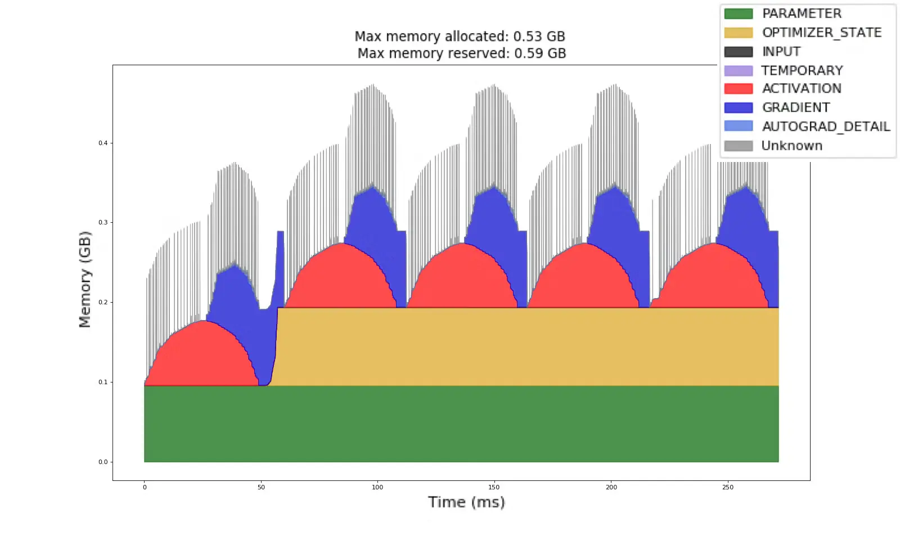
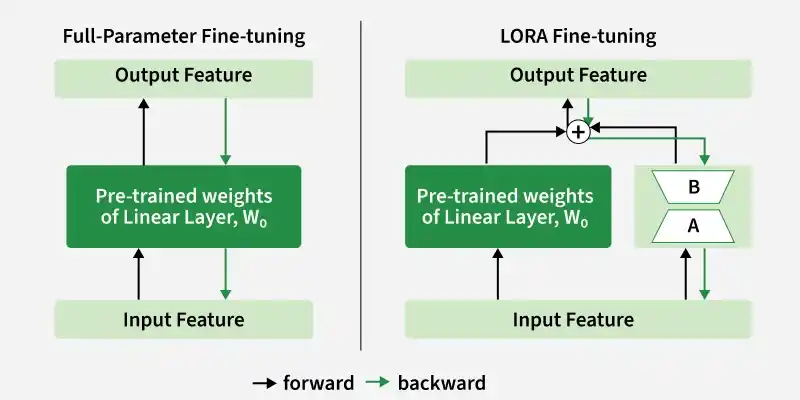

# Give your LLM a character

Modern language models are rather good at making words follow other words. They are also rather large. Getting one onto a GPU, let alone teaching it something new, can turn into a memory puzzle. Every gigabyte we avoid using is also a small favour to the budget.

In this practical, you will try Nebius Serverless AI with a model from the [Qwen2.5 family](https://huggingface.co/collections/Qwen/qwen25). First, deploy a model behind an API and ask it a few questions from your DevLab. Then use a GPU Job to fine-tune it on a character's dialogue and serve the result through another endpoint. The dialogue comes from Shakespeare plays or public-domain character roleplay: Dracula, Sherlock Holmes, Odysseus, Dorian Gray, and the Cheshire Cat. This is an excuse to give a model a voice and a soul  and to discover what the GPU actually has to hold while you do it.

You will use a **Job** for training, which finishes after running the task, and an **Endpoint** for inference, which stays available for requests. The DevLab is where you edit the training configuration and run the small [notebook](lab.ipynb). The containers already have the serving or training software installed. You do not have to build them.

## Every token counts

A language model takes the tokens it has seen so far and predicts the next one. A token can be a word, part of a word, or punctuation. Transformer-based models such as Qwen2.5 generate one token after another; their learned weights encode patterns that let them produce useful answers. The **B** in 7B means *billion* parameters. You can now guess why they are called *large* language models. The family includes instruction-tuned variants at [7B](https://huggingface.co/Qwen/Qwen2.5-7B-Instruct), [14B](https://huggingface.co/Qwen/Qwen2.5-14B-Instruct), [32B](https://huggingface.co/Qwen/Qwen2.5-32B-Instruct), [72B](https://huggingface.co/Qwen/Qwen2.5-72B-Instruct), and other sizes. We use the **Instruct** variants because they are trained to follow chat messages

A weight is a number stored as bits, the 0s and 1s in computer memory. Eight bits make one byte. There are different ways to represent numbers with those bits: **FP32** is a 32-bit floating-point format (4 bytes per weight), while **BF16** uses 16 bits (2 bytes). BF16 uses less memory at the cost of numerical precision. We do not need the details of its encoding here, but for a first estimate of the memory required by a model, use:

```text
weight memory (bytes) ≈ number of parameters × bytes per parameter
weight memory (GB)    ≈ weight memory (bytes) / 1,000,000,000
```

Ignoring everything else, a 7B model needs roughly **28 GB in FP32 or 14 GB in BF16**. BF16 is widely used for LLM workloads because it halves weight storage compared with FP32 while usually retaining enough precision for training and inference (BF16 preserves FP32’s wide range of representable values—roughly from 10⁻³⁸ to 10³⁸—at the cost of reduced numerical precision. In practice, this wide range is often more valuable than extremely fine precision for model training and inference).


The NVIDIA H100 in this exercise has [80 GB of GPU memory](https://www.nvidia.com/en-us/data-center/h100/). The preset also lists 200 GiB of system RAM, which is a different pool. The GPU does the calculations and reads the model's weights again and again as it generates tokens. Its own high-bandwidth memory can supply those weights much faster than transferring them from system RAM, so in this setup the weights need to fit on the GPU. **Before creating an endpoint, estimate the BF16 weight memory for 32B and 72B. Which one looks plausible on one H100?** Leave room beyond the weights.

Why the extra room? At each Transformer layer, a token produces attention **keys** and **values**. When the model generates the next token, it can reuse the earlier ones instead of recalculating the whole conversation. The stored keys and values are the **KV cache**. Longer conversations and more simultaneous requests need more cache; for a fixed model, its size grows roughly with the number of cached tokens. Our prompts are short, but the cache and other serving buffers still need GPU memory.

Training needs more. Besides weights, it keeps **activations**: intermediate results produced as examples pass through the layers. Some are needed again when the model calculates how to update its weights. Training also stores a **gradient** for each trainable weight and optimizer state. Adam optimizer, for example, tracks two running values per trainable weight. If we *pretend* all these values use BF16, full fine-tuning needs **2 bytes for a weight + 2 for its gradient + 2 + 2 for Adam = 8 bytes per parameter**, before activations. **Try this calculation for 14B. Does it fit in 80 GB?** Real optimizer states may use FP32, so the estimate can be optimistic. A larger microbatch processes more examples together: it usually needs more activation memory, while averaging more examples can make the gradient less noisy. [PyTorch's activation-memory guide](https://docs.pytorch.org/tutorials/beginner/mosaic_memory_profiling_tutorial.html) shows why keeping intermediate results matters.


[](https://pytorch.org/blog/understanding-gpu-memory-1/)

*GPU memory profile over several training steps. This example uses vanilla SGD with momentum, which stores one optimizer value per weight; as a result, optimizer memory is the same as parameter memory. Source: [PyTorch Blog](https://pytorch.org/blog/understanding-gpu-memory-1/).*

**LoRA** leaves the model’s original weights frozen and learns only a small update for each selected weight matrix. Instead of storing a full-sized update, it represents that update as the product of two smaller matrices (A and B in the image). Their inner dimension is the **rank** (`lora_r` in our YAML): a lower rank uses less memory but limits how much the model can change. These learned matrices form the **adapter**, so gradients and optimizer states are needed only for them. The full base model must still fit in memory, and the saved adapter must be loaded with the same base model to produce the fine-tuned behaviour. [This LoRA explanation](https://huggingface.co/docs/peft/main/task_guides/lora_based_methods) goes further if you are curious.

[](https://www.geeksforgeeks.org/deep-learning/low-rank-adaptation-lora/)

*Full parameter fine-tuning updates all weights, while LoRA trains only small adapter matrices. Source: [GeeksforGeeks](https://www.geeksforgeeks.org/deep-learning/low-rank-adaptation-lora/).*
## Put a model behind an API

Open the Nebius console and go to **Serverless AI → Endpoints → Create endpoint → Custom**. An endpoint starts a container, runs a command in it and exposes the port as an HTTPS API. Inside that container, [vLLM](https://docs.vllm.ai/en/latest/serving/openai_compatible_server/) loads the model onto the GPU, manages requests and its KV cache, and returns generated text through an API compatible with the OpenAI Python SDK. Later it will also let us select the base model or its LoRA adapter by model name.

Use these values for the first endpoint. Give it a name you will recognize, such as `my-base-model` or your group name.

| Console field | Value |
|---|---|
| Image path | `docker.io/vllm/vllm-openai:latest` |
| Port | `8000` (HTTP) |
| Compute | GPU, regular NVIDIA H100; 1 GPU, 16 vCPUs, 200 GiB RAM |
| Container disk | 200 GiB |
| Network / subnet | The available default for your project |
| Bearer-token authentication | Off for this classroom endpoint |
| Mounted volumes | None |

The image contains vLLM and its dependencies. Its entrypoint command tells it which model to download and how to run the API. The command below uses the default 14B Instruct model; replace the value after `--model` only if you choose another size:

```bash
python3 -m vllm.entrypoints.openai.api_server --model Qwen/Qwen2.5-14B-Instruct --dtype bfloat16 --max-model-len 2048 --gpu-memory-utilization 0.85 --host 0.0.0.0 --port 8000
```

`--dtype` selects BF16, `--max-model-len` limits the total input and output context, and `--gpu-memory-utilization` sets vLLM's GPU-memory budget. **Use your weight-memory estimate to choose a model before you launch it.** Could it fit with room for the KV cache and serving overhead (assume at least 5 extra GB needed)? Which is the largest size you would try on this GPU? Change `--model`, create the endpoint and wait for it to become ready. Copy its HTTPS URL from **Copy endpoint URL → Public endpoint**. The [Nebius endpoint guide](https://docs.nebius.com/serverless/tutorials/deploy-model) shows this console flow.

Open [the notebook](lab.ipynb), paste the URL, and play with its ready-made questions. Ask one of your own, too. Then open the endpoint's **Logs** tab in the Nebius Console. During startup, look for the model name, dtype, maximum sequence length, and the line that reports GPU memory use. How does the reported memory compare with your weight-only estimate? Can you spot the memory set aside for the KV cache? After sending a notebook request, look for `POST /v1/chat/completions` with `200 OK` and an engine log showing prompt or generation throughput. In the **Metrics** tab you can monitor the state of the virtual machine on which the endpoint is running. Click on **GPU metrics** and send a request from the notebook. What changes while a request is running? (The Metrics tab can sometimes be buggy, so if nothing happens, do not worry too much and continue with the practical.)

The logs make the memory budget more concrete than a single dashboard number. In one Qwen2.5-32B test with the command above, vLLM used 61.97 GiB for weights and other non-PyTorch memory, 3.18 GiB for peak activations, 0.62 GiB for CUDA graphs, and 2.15 GiB for the KV cache. That cache held 8,800 tokens, or about four concurrent requests at the 2,048-token limit. Your values will depend on the image and settings. The KV cache holds attention keys and values for tokens already processed; vLLM's logs also estimate how many tokens and simultaneous requests fit in that cache.


Once you have played with it, stop this first endpoint; the final endpoint will let you query both the base and adapted model on one GPU.

## Give it a voice

Now for the training Job. We prepared chat-format JSONL datasets from [Shakespeare dialogue](https://huggingface.co/datasets/chaseharmon/6.7960_Shakespeare) and [public-domain character roleplay](https://huggingface.co/datasets/agentlans/practical-dreamer-RPGPT_PublicDomain). Each line is one conversation, for example:

```json
{"messages": [{"role": "user", "content": "I seem to have lost my way."}, {"role": "assistant", "content": "Perhaps the way has lost you."}]}
```

The example above is just an illustration. The character material is roleplay inspired by the characters, rather than quotations from the original books. Shakespeare consists of adjacent lines from plays; its language is Early Modern English. The user message supplies the context, and we train the model to predict the assistant response. In the YAML this is expressed by `roles_to_train: [assistant]` and `train_on_inputs: false`.

Choose a dataset. For a first run, the Cheshire Cat and other character datasets are short; Shakespeare is larger.

| Voice | Directory inside the Job |
|---|---|
| Cheshire Cat | `/inputs/datasets/public-domain/the-cheshire-cat/` |
| Dracula | `/inputs/datasets/public-domain/count-dracula/` |
| Sherlock Holmes | `/inputs/datasets/public-domain/sherlock-holmes/` |
| Odysseus | `/inputs/datasets/public-domain/odysseus/` |
| Dorian Gray | `/inputs/datasets/public-domain/dorian-gray/` |
| Shakespeare dialogue | `/inputs/datasets/shakespeare/` |

If the datasets are visible in your DevLab, open a `train.jsonl` file and look at a couple of lines. What are the input and the answer?
### Make your training configuration

Open [training.yaml](training.yaml). This one YAML file is the starting point for every voice. [Axolotl](https://docs.axolotl.ai/) reads it to load the model and data, train LoRA, and choose checkpoints. Find `base_model`, `datasets`, `test_datasets`, `sequence_len`, `bf16`, and `lora_r`. **What is the longest training sequence this configuration allows? What precision will the job use? What LoRA parameters are used?**

Edit *both* dataset paths to your chosen directory, keeping `train.jsonl` for training and `validation.jsonl` for validation. The default is `Qwen/Qwen2.5-14B-Instruct`, which is the balanced choice for this workshop. You may instead set `base_model` to `Qwen/Qwen2.5-7B-Instruct` for a faster run or `Qwen/Qwen2.5-32B-Instruct` for the ambitious option that exploit  most of the H100's memory. Use the same exact model ID for the first endpoint, training job, and final endpoint: a LoRA adapter can only be loaded with the base checkpoint on which it was trained. 

Use one batch configuration for every run: `micro_batch_size: 8` and `gradient_accumulation_steps: 2`, for an effective batch of 16. Keep `lora_r: 16`. Use the schedule below for the dataset you chose:

| Dataset | Learning rate | Max steps | Eval/save every | Patience |
|---|---:|---:|---:|---:|
| Character roleplay | `0.00005` | 90 | 15 | 1 |
| Shakespeare | `0.0002` | 375 | 125 | 1 |

 With `load_best_model_at_end: true`, Axolotl saves the checkpoint with the best validation loss. 

A **microbatch** is the number of examples processed together. Axolotl accumulates gradients across two microbatches before updating the adapter. Gradient checkpointing in the YAML saves memory by recomputing some intermediate values.

**What about the training memory for your model?** Build the estimate rather than starting from the formula. For rank 16, assume that the adapter contains roughly **0.5% of the base parameters**, so `A ≈ 0.005 × P`.

Ask what must be stored for each type of parameter:

1. The `P` base parameters are frozen. They need one BF16 value each, but no gradients or optimizer states. How many bytes is that per parameter?
2. Each of the `A` trainable adapter parameters needs its BF16 weight, its gradient, and the two running values maintained by Adam. If we pretend they are all BF16, how many bytes is that per parameter?

Use your answers to complete the estimate:

```text
LoRA training state (bytes) ≈ ___P + ___A
```

Write down your reasoning before continuing. You can check your answer in the Solutions section at the end of this practical.

**Estimate this for 14B and 32B, then leave at least another 10 GB for activations, temporary buffers and the runtime. Which would you try on 80 GB?** This is a rough budget: optimizer  states can use a higher precision, and activations depend on sequence length and microbatch. 


On one H100, 14B is the recommended choice for this 45-minute workshop. 32B can train on a short character dataset, but takes longer and leaves less room for long examples. If a job runs out of memory, lower `micro_batch_size` and raise `gradient_accumulation_steps` to keep the effective batch near 16. You can also try `lora_r: 8` and `lora_alpha: 16` as a separate experiment. Roughly how would halving rank affect `A` and the *total* memory estimate?

### Start a GPU Job

In the console, open **Serverless AI → Jobs → Create job**. Choose the **Axolotl template** and replace its defaults with these settings; the **Custom** route works too. The [Nebius fine-tuning tutorial](https://docs.nebius.com/serverless/tutorials/fine-tuning) has screenshots of the console.

| Console field | Value |
|---|---|
| Name | Something recognizable, such as `cheshire-training` |
| Image path | `docker.io/axolotlai/axolotl:main-20260309-py3.11-cu128-2.9.1` |
| Compute, disk, network | H100, 1 GPU / 16 vCPUs / 200 GiB RAM, 200 GiB disk, your project's default subnet |
| Timeout | 2 hours |
| First mounted volume | `uu-workshop-input` at `/inputs`, read-only |
| Second mounted volume | `uu-workshop-output` at `/outputs`, read-write |
| Files | Paste or upload your entire edited YAML at `/config/axolotl.yaml` |

A mounted Object Storage bucket appears as files in the container. For example, `s3://uu-workshop-input/datasets/shakespeare/train.jsonl` becomes `/inputs/datasets/shakespeare/train.jsonl`. The input mount supplies datasets and the runner script (the same files you find here in `data/` and `src/`); the output mount receives the adapter and run artifacts. In **Files**, paste the YAML from your editor, or download it from JupyterLab and upload it from your computer. See [Nebius's Job guide](https://docs.nebius.com/serverless/jobs/manage) for those controls.

The 200 GiB container disk is separate from GPU memory. It provides room for the container image, the downloaded model shards, and the Hugging Face cache; 100 GiB is not enough for the 32B option in this setup.

Give the entrypoint this command. Choose a short group name and a unique run ID; use a new ID for each training attempt:

```bash
bash -c "bash /inputs/releases/v2/run_job.sh /config/axolotl.yaml my-group run-1"
```

This starts the included `run_job.sh` script with your YAML, group and run ID. Use lowercase letters, numbers and hyphens, with no spaces. It trains with Axolotl, then writes the results to `/outputs/my-group/runs/run-1/`. Choose a group name that identifies your team; the run ID distinguishes this attempt from others in that group. Use a new run ID for each attempt. Click **Create job** and watch the logs. The script prints the output path, and saves `training.log`, loss plots, and a small automatic comparison alongside `adapter/`.

While the Job runs, look for a line like this in its logs:

```text
trainable params: xxx || all params: xxx || trainable%: xxx
```

How many of *your* model's parameters are trainable? What percentage is that? Compare your earlier full-training estimate with `2P + 8A` using your log values (`P = all params − A`). Then find `memory/max_allocated (GiB)` and `memory/device_reserved (GiB)` in the training logs. What is the highest value you can find for each, and how does it compares with the estimate you made? The actual GPU memory can also include activations and runtime overhead that the simple estimate leaves out.

The logs show how the run progresses as well. Find a training `loss` and an `eval_loss` near the start and later in the run. Are they going in the same direction? A falling loss means the model is getting better at the training objective, but it does not by itself prove that the character responses are more convincing.

Finally, find the lines saying where Axolotl saved the model and where the workshop runner saved the results. The paths inside the container logs may differ from the final `/outputs/...` path, so follow the runner's final “Results saved to” message to find the run in Object Storage.

## Put the character on stage

Once training has finished, browse **Storage → Object Storage → uu-workshop-output → your group → runs → your run ID**. The run folder contains `loss.svg`, `loss.csv`, `comparison.md`, `training.log`, and an `adapter/` directory. Take a few minutes to inspect the results before deploying anything (you need to download them one by one).

Start with `loss.svg`. Where is the validation loss lowest, and which checkpoint does the plot mark as best? Compare that step with `max_steps` in your YAML and the final step in `training.log`: did the run use the full step budget? The recommended configurations use `early_stopping_patience: 1`, so training can stop after one evaluation without an improvement in validation loss. With `load_best_model_at_end: true`, the adapter saved for you comes from the checkpoint with the best validation loss; it may not be the last step that ran.

Then open `comparison.md`. It shows the base model and the adapter answering the same held-out validation prompts. Do you notice a change in voice or personality? Which example makes the difference clearest? Does the adapted model still respond coherently to the prompt? 

Finally, open `adapter/` and check that `adapter_config.json` and `adapter_model.safetensors` are present. `adapter_config.json` records the exact base model and LoRA rank. You will use this adapter folder's path when you configure the next endpoint.

Create another **Custom endpoint** with the same image, port, GPU, disk and network settings as before. This time mount `uu-workshop-output` at `/outputs`. This will make the artifacts from the training job available to the endpoint machine. Use the exact base model and rank from `adapter_config.json`. Replace `my-group` and `run-1` below with the group name and run ID you chose:

```bash
python3 -m vllm.entrypoints.openai.api_server --model Qwen/Qwen2.5-14B-Instruct --dtype bfloat16 --max-model-len 2048 --gpu-memory-utilization 0.85 --enable-lora --max-lora-rank 16 --lora-modules character=/outputs/my-group/runs/run-1/adapter --host 0.0.0.0 --port 8000
```

The model name `character` refers to the adapter, so you can query the fine-tuned model with that name. vLLM can [serve the base model and its LoRA adapter together](https://docs.vllm.ai/en/latest/features/lora/). Reconnect the notebook to this new endpoint. Ask the base model and `character` the same question, then try your own prompts. Does it sound more like your chosen voice? Does it still answer the question? No need to score it: have a look and play.

When you are done, stop the endpoints in the console so they no longer reserve a GPU. Your training outputs remain in Object Storage.

## One more voice: Nebius Token Factory

Your LoRA adapter changes a model’s behaviour by learning new weights. Now try a different approach with **Nebius Token Factory**, a hosted API that provides access to larger models without deploying them on your H100. These models may already know how Shakespeare or familiar literary characters speak, so we can steer them using a **system prompt** instead of fine-tuning them.

A system prompt is simply part of the text given to the model before the user’s question. Chat models are trained to treat it as a high-priority instruction, so it influences which words the model is likely to generate—for example, encouraging a Victorian tone or Shakespearean language. It does not change the model’s weights, must be sent again with each new conversation, and different models may follow it with different levels of consistency.

Token Factory uses the same OpenAI-compatible chat format as vLLM. Only the client configuration changes: you use the Token Factory API address and a class API key. Each request still specifies a model and a list of messages, where `system` defines the role and style and `user` supplies the question. See the [Token Factory quickstart](https://docs.tokenfactory.nebius.com/quickstart) if you want to learn more.

Run the final Token Factory cells in `lab.ipynb`. The notebook requests the API key using hidden input, lists the available models, and lets you select one. Choose a character system prompt and ask the same question you gave your fine-tuned model.

How close does the prompt-only answer come to the desired style? What does the LoRA adapter add, if anything? You are comparing two ways of shaping a model’s output: learning adapter weights during training and providing instructions at generation time.


### LoRA training-memory estimate

BF16 uses 2 bytes per value. Because the base model is frozen, its `P` parameters require only their stored weights:

```text
Base-model weights = 2P bytes
```

Each trainable adapter parameter needs four values: its weight, its gradient, and the two running values maintained by Adam. Under our simplified assumption that all four use BF16:

```text
Adapter training state = 4 × 2A = 8A bytes
```

Therefore:

```text
LoRA training state ≈ 2P + 8A bytes
```

Real Adam states may use FP32, so this estimate can be optimistic.
